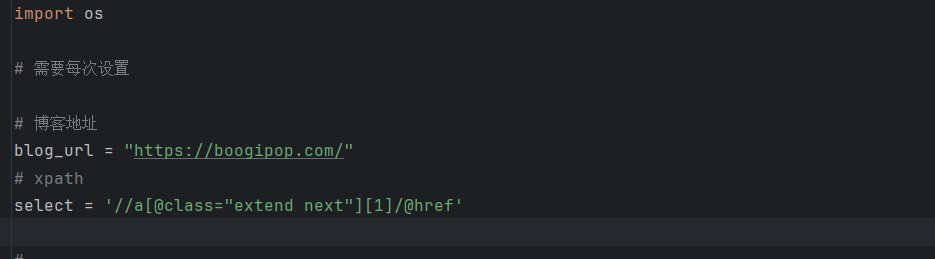
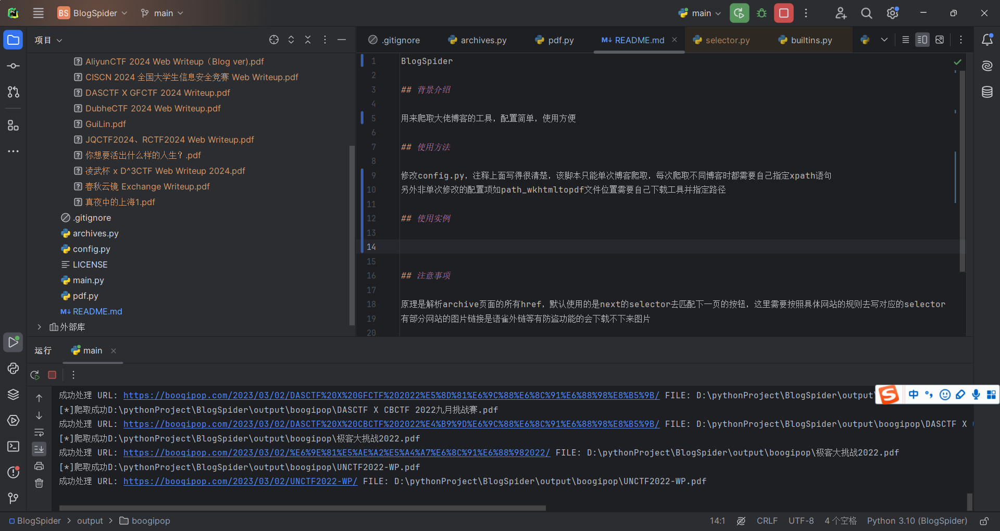

BlogSpider

## 背景介绍

用来爬取大佬博客的工具，配置简单，使用方便

## 使用方法

修改config.py，注释上面写得很清楚，该脚本只能单次博客爬取，每次爬取不同博客时都需要自己指定xpath语句
另外非单次修改的配置项如path_wkhtmltopdf文件位置需要自己下载工具并指定路径

## 使用实例




## 注意事项

有部分网站的图片链接是语雀外链等有防盗功能的会下载不下来图片

## 更新日志

```markdown
2024/6/16: 1.1版本发布
2024/6/16: 1.2版本发布
    修复url访问报错的异常处理
    添加console_mode、retry功能
```
